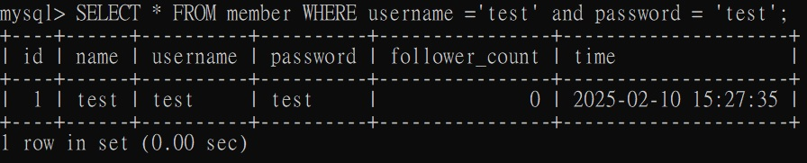
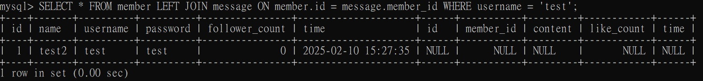
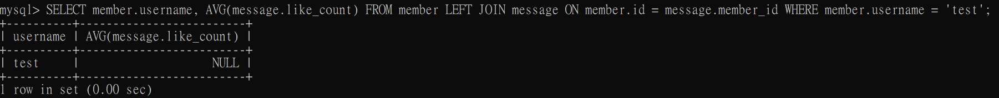

# Week-5 Tasks
## Task 2
1. Create a new database named website.
```sql
CREATE database website;
```


2. Create a new table named member, in the website database, designed as below.
```sql
USE website;
CREATE TABLE member(
    id BIGINT PRIMARY KEY AUTO_INCREMENT,
    name VARCHAR(255) NOT NULL,
    username VARCHAR(255) NOT NULL,
    password VARCHAR(255) NOT NULL,
    follower_count INT UNSIGNED NOT NULL DEFAULT 0,
    time DATETIME NOT NULL DEFAULT CURRENT_TIMESTAMP);
```


## Task 3
1. INSERT a new row to the member table where name, username and password must be set to test. INSERT additional 4 rows with arbitrary data.
```sql
INSERT INTO member(name, username, password) VALUES('test', 'test', 'test');
INSERT INTO member(name, username, password) VALUES('阿包', '阿包', '123');
INSERT INTO member(name, username, password) VALUES('棉花糖', '棉花糖', '456');
INSERT INTO member(name, username, password) VALUES('花生粽', '花生粽', '789');
INSERT INTO member(name, username, password) VALUES('巧克力', '巧克力', '777');
```


2. SELECT all rows from the member table.
```sql
SELECT * FROM member;
```


3. SELECT all rows from the member table, in descending order of time.
```sql
SELECT * FROM member ORDER BY time DESC;
```


4. SELECT total 3 rows, second to fourth, from the member table, in descending order of time. Note: it does not mean SELECT rows where id are 2, 3, or 4.
```sql
SELECT * FROM member ORDER BY time DESC LIMIT 3 OFFSET 1;
```


5. SELECT rows where username equals to test.
```sql
SELECT * FROM member WHERE username = 'test';
```


6. SELECT rows where name includes the es keyword.
```sql
SELECT * FROM member WHERE name LIKE '%es%';
```


7. SELECT rows where both username and password equal to test.
```sql
SELECT * FROM member WHERE username = 'test' and password = 'test';
```


8. UPDATE data in name column to test2 where username equals to test.
```sql
UPDATE member SET name = 'test2' WHERE username = 'test';
```


## Task 4
1. SELECT how many rows from the member table.
```sql
SELECT COUNT(*) FROM member;
```


2. SELECT the sum of follower_count of all the rows from the member table.
```sql
SELECT SUM(follower_count) FROM member;
```


3. SELECT the average of follower_count of all the rows from the member table.
```sql
SELECT AVG(follower_count) FROM member;
```


4. SELECT the average of follower_count of the first 2 rows, in descending order of follower_count, from the member table.
```sql
SELECT AVG(follower_count) FROM (SELECT follower_count FROM member ORDER BY follower_count DESC LIMIT 2) AS subquery;
```


## Task 5
1. Create a new table named message, in the website database. designed as below.
```sql
CREATE TABLE message(
    id BIGINT PRIMARY KEY AUTO_INCREMENT,
    member_id BIGINT NOT NULL,
    content VARCHAR(255) NOT NULL,
    like_count INT UNSIGNED NOT NULL DEFAULT 0,
    time DATETIME NOT NULL DEFAULT CURRENT_TIMESTAMP,
    FOREIGN KEY(member_id) REFERENCES member(id));
```


2. SELECT all messages, including sender names. We have to JOIN the member table to get that.
```sql
SELECT * FROM member LEFT JOIN message ON member.id = message.member_id;
```


3. SELECT all messages, including sender names, where sender username equals to test.We have to JOIN the member table to filter and get that.
```sql
SELECT * FROM member LEFT JOIN message ON member.id = message.member_id WHERE username = 'test';
```


4. Use SELECT, SQL Aggregation Functions with JOIN statement, get the average like count of messages where sender username equals to test.
```sql
SELECT member.username, AVG(message.like_count) FROM member LEFT JOIN message ON member.id = message.member_id WHERE member.username = 'test';
```


5. Use SELECT, SQL Aggregation Functions with JOIN statement, get the average like count of messages GROUP BY sender username.
```sql
SELECT member.username, AVG(message.like_count) FROM member LEFT JOIN message ON member.id = message.member_id GROUP BY member.username;
```
